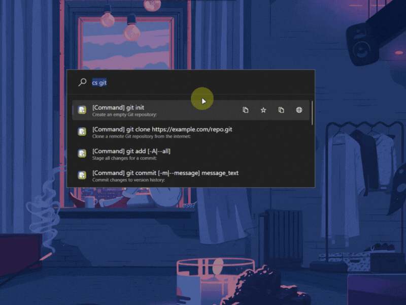
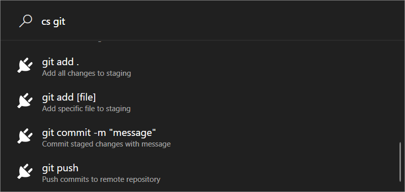
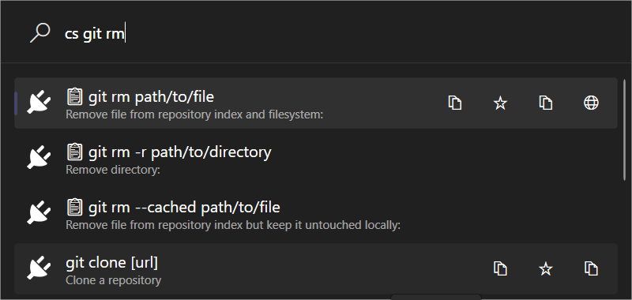
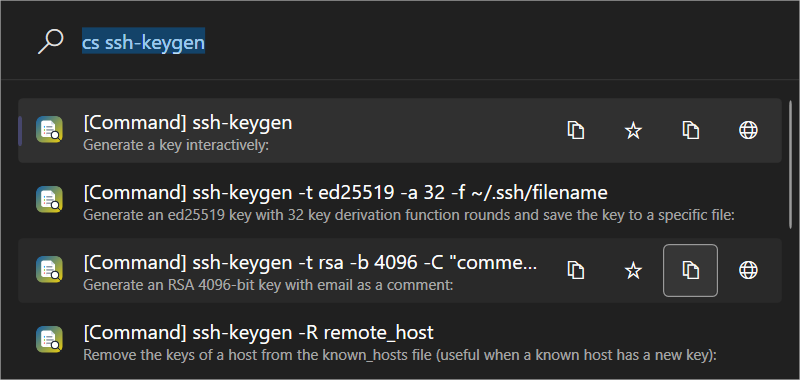

<div align="center">

# ⚡ CheatSheets for PowerToys Run


### *The Ultimate Developer's Reference Library - Right at Your Fingertips*

**Never leave your terminal or IDE to find command syntax again.**  
Access 10,000+ cheat sheets instantly with `Alt+Space` → `cs git commit` → Done! ✨

[](https://github.com/ruslanlap/PowerToysRun-CheatSheets/releases/latest)
[](https://github.com/ruslanlap/PowerToysRun-CheatSheets/releases/latest)
[](https://github.com/ruslanlap/PowerToysRun-CheatSheets/stargazers)
[](https://github.com/hlaueriksson/awesome-powertoys-run-plugins)

</div>

---

## 🎯 Why Developers Love CheatSheets

<div align="center">

**"Stop switching between browser tabs to find that Git command"**

| ❌ Before | ✅ With CheatSheets |
|-----------|-------------------|
| Open browser → Google → StackOverflow → Copy | `Alt+Space` → `cs git reset` → Copy |
| 30+ seconds, context switching | **2 seconds, zero interruption** |

</div>

### 🚀 **Quick Demo** - Try it now:
```
Alt+Space → cs docker run    # 🐳 Docker commands
Alt+Space → cs git commit    # 🌿 Git workflows  
Alt+Space → cs:popular       # 🔥 Trending commands
Alt+Space → cs:fav           # ⭐ Your favorites
```

<div align="center">
  
  
  **⬇️ Ready to boost your productivity?**
  
  <a href="https://github.com/ruslanlap/PowerToysRun-CheatSheets/releases/download/v1.0.0/CheatSheets-1.0.0-x64.zip">
    
  </a>
  <a href="https://github.com/ruslanlap/PowerToysRun-CheatSheets/releases/download/v1.0.0/CheatSheets-1.0.0-ARM64.zip">
    
  </a>
</div>

## 🧭 Table of Contents

- [Overview](#-overview)
- [Features](#-features)
- [Demo](#-demo)
- [Quick Start](#-quick-start)
- [Installation](#-installation)
- [Usage](#-usage)
- [Configuration Tips](#-configuration-tips)
- [Updating](#-updating)
- [What's New in v1.0.0](#-whats-new-in-v100)
- [Building from Source](#-building-from-source)
- [Development & Quality](#-development--quality)
- [Project Structure](#-project-structure)
- [FAQ](#-faq)
- [Troubleshooting](#-troubleshooting)
- [Security & Privacy](#-security--privacy)
- [Tech Stack](#-tech-stack)
- [Contributing](#-contributing)
- [Screenshots](#-screenshots)
- [Support the Project](#-support-the-project)
- [License](#-license)
- [Acknowledgements](#-acknowledgements)


## 📝 Overview

**CheatSheets** keeps command references at your fingertips directly inside PowerToys Run. Search across [tldr pages](https://tldr.sh/), [cheat.sh](https://cheat.sh/), [devhints.io](https://devhints.io/), and offline documentation with fuzzy matching, smart caching, and zero browser context switching. Launch PowerToys Run with `Alt+Space`, type `cs` (or your custom keyword), and jump straight to the command you need.

- **Plugin ID:** `41BF0604C51A4974A0BAA108826D0A94`
- **Action Keyword:** `cs` or change to `cheatsheet`
- **Platform:** Windows 10/11 (x64, ARM64)
- **Tech:** C#/.NET, WPF, PowerToys Run API

---

## ⚡ Features That Matter

<div align="center">
<table>
<tr>
<td align="center" width="33%">

<br><b>🔍 Lightning Search</b><br>
<sub>Fuzzy matching finds what you need<br>even with typos</sub>
</td>
<td align="center" width="33%">

<br><b>📚 Rich Sources</b><br>
<sub>tldr, cheat.sh, devhints.io<br>& offline documentation</sub>
</td>
<td align="center" width="33%">

<br><b>⭐ Smart Favorites</b><br>
<sub>Your most-used commands<br>always within reach</sub>
</td>
</tr>
<tr>
<td align="center" width="33%">

<br><b>⚡ Blazing Fast</b><br>
<sub>Background caching ensures<br>instant results</sub>
</td>
<td align="center" width="33%">

<br><b>🌐 Works Offline</b><br>
<sub>Full functionality without<br>internet connection</sub>
</td>
<td align="center" width="33%">

<br><b>📊 Learning AI</b><br>
<sub>Adapts to your usage patterns<br>for better suggestions</sub>
</td>
</tr>
</table>
</div>

---

## 📸 Screenshots Gallery

<div align="center">

### Search in Action


### Browse by Category  


### Plugin Settings


</div>

---

## 🏃‍♂️ Get Started in 60 Seconds

### 1️⃣ **Download & Extract** (15 seconds)
```bash
# Choose your architecture
wget https://github.com/ruslanlap/PowerToysRun-CheatSheets/releases/download/v1.0.0/CheatSheets-1.0.0-x64.zip
# Extract to PowerToys plugin directory
```

### 2️⃣ **Auto-Install Location** (30 seconds)
```
%LOCALAPPDATA%\Microsoft\PowerToys\PowerToys Run\Plugins\CheatSheets
```

### 3️⃣ **Restart PowerToys** (15 seconds)
Right-click PowerToys tray icon → Exit → Restart from Start Menu

### 4️⃣ **Test Drive** 🎯
Hit `Alt+Space` → Type `cs docker run` → Marvel at the magic! ✨

> **Pro Tip:** Change the keyword from `cs` to `ch` or `cheat` in PowerToys settings for even faster access!


---

## 💡 Power User Commands

<div align="left">

```bash
# 🔥 Most Popular Commands
cs:popular                 # Trending commands across all developers

# ⭐ Personal Favorites  
cs:fav                     # Your curated command collection

# 📂 Browse by Technology
cs:git                     # Git version control commands
cs:docker                  # Container management 
cs:python                  # Python development
cs:kubernetes              # K8s orchestration
cs:aws                     # Cloud services

# 🎯 Direct Search
cs git commit -m           # Find specific Git syntax
cs kubectl get pods       # Kubernetes operations
cs ffmpeg convert          # Media processing
```

</div>

<details>
<summary><b>🎨 See All Available Categories</b></summary>

`cs:bash` `cs:vim` `cs:tmux` `cs:curl` `cs:grep` `cs:sed` `cs:awk` `cs:nginx` `cs:apache` `cs:mysql` `cs:postgres` `cs:redis` `cs:mongodb` `cs:elasticsearch` `cs:terraform` `cs:ansible` `cs:jenkins` `cs:prometheus` `cs:grafana` and many more...

</details>

## 🔧 Advanced Configuration

<details>
<summary><b>🎯 Customize Your Experience</b></summary>

### Change Trigger Keyword
**PowerToys Settings** → **PowerToys Run** → **Plugins** → **CheatSheets** → Change `cs` to your preference

### Optimize Performance  
- **Cache Duration**: Adjust for faster offline access
- **Data Sources**: Enable/disable tldr, cheat.sh, or offline docs
- **Background Sync**: Configure auto-refresh intervals

### Manage Your Data
- **Export Favorites**: Backup your curated commands
- **Clear History**: Fresh start with usage tracking
- **Offline Mode**: Work without internet connection

</details>

---

## 🏗️ For Developers

### 🚀 **Quick Build**
```bash
git clone https://github.com/ruslanlap/PowerToysRun-CheatSheets.git
cd PowerToysRun-CheatSheets
./build-and-zip.sh  # Creates distribution-ready packages
```

### 🧪 **Tech Stack**
- **Runtime**: .NET 9.0 with Windows 10/11 target  
- **UI**: WPF with theme-aware design
- **Storage**: SQLite with smart caching
- **Architecture**: Service-oriented with clean separation

### 🎯 **Project Highlights**  
- **Clean Code**: Well-documented, testable architecture
- **Multi-Platform**: x64 + ARM64 builds
- **CI/CD Ready**: GitHub Actions automation
- **Plugin Template**: Great starting point for other PowerToys plugins

<div align="left">

**Want to contribute?** 

[](CONTRIBUTING.md) 
[](https://github.com/ruslanlap/PowerToysRun-CheatSheets/issues)

</div>

---

## 🌟 Community & Support

<div align="left">

### Show Some Love ❤️

If CheatSheets saves you time, consider starring the repo and sharing with fellow developers!

[](https://github.com/ruslanlap/PowerToysRun-CheatSheets/stargazers)
[](https://twitter.com/intent/tweet?text=Just%20found%20this%20amazing%20PowerToys%20Run%20plugin%20for%20cheat%20sheets!%20🚀&url=https://github.com/ruslanlap/PowerToysRun-CheatSheets)

### Support Development ☕

[](https://ruslanlap.github.io/ruslanlap_buymeacoffe/)

### Join the Community

- 🐛 [Report bugs](https://github.com/ruslanlap/PowerToysRun-CheatSheets/issues)
- 💡 [Request features](https://github.com/ruslanlap/PowerToysRun-CheatSheets/issues)  
- 🤝 [Contribute](CONTRIBUTING.md)
- 📢 [Awesome PowerToys Plugins](https://github.com/hlaueriksson/awesome-powertoys-run-plugins)

</div>

---

## 🆘 Troubleshooting

<details>
<summary><b>Plugin not showing up?</b></summary>

- ✅ **Check path**: `%LOCALAPPDATA%\Microsoft\PowerToys\PowerToys Run\Plugins\CheatSheets`  
- ✅ **Verify files**: Ensure `plugin.json` exists in the folder
- ✅ **Restart**: Completely exit and restart PowerToys
- ✅ **Permissions**: Run PowerToys as administrator once

</details>

<details>
<summary><b>No search results?</b></summary>

- ✅ **Internet**: Check connection for first-time data sync
- ✅ **Cache**: Refresh cache in plugin settings
- ✅ **Keyword**: Ensure you're using `cs` prefix (or your custom keyword)

</details>

<details>
<summary><b>Favorites not saving?</b></summary>

- ✅ **Permissions**: Ensure PowerToys can write to settings directory
- ✅ **Disk space**: Check available storage 
- ✅ **Antivirus**: Temporarily disable if blocking file writes

</details>

---

<details>
<summary><b>📋 Table of Contents</b></summary>

- [Why Developers Love CheatSheets](#-why-developers-love-cheatsheets)
- [Features That Matter](#-features-that-matter)  
- [Screenshots Gallery](#-screenshots-gallery)
- [Get Started in 60 Seconds](#️-get-started-in-60-seconds)
- [Power User Commands](#-power-user-commands)
- [Advanced Configuration](#-advanced-configuration)
- [For Developers](#️-for-developers)
- [Community & Support](#-community--support)
- [Troubleshooting](#-troubleshooting)
- [License](#-license)

</details>

---

## ❓ FAQ

<details>
<summary><b>How do I add commands to favorites?</b></summary>
Right-click any search result → "Add to Favorites" → Access with <code>cs:fav</code>
</details>

<details>
<summary><b>Can I use it offline?</b></summary>
Yes! After initial sync, everything works offline. Perfect for flights and remote work.
</details>

<details>
<summary><b>How do I change the trigger keyword?</b></summary>
PowerToys Settings → PowerToys Run → Plugins → CheatSheets → Change "cs" to your preference
</details>

<details>
<summary><b>What data sources are included?</b></summary>
tldr pages, cheat.sh community content, devhints.io, and curated offline documentation
</details>

<details>
<summary><b>Is my data private?</b></summary>
100% local storage. No tracking, no cloud sync, no data collection. Your favorites stay on your machine.
</details>

---

## 🔒 Privacy & Security

- ✅ **100% Local**: All data stored on your machine
- ✅ **No Tracking**: Zero analytics or telemetry 
- ✅ **Open Source**: Full code transparency
- ✅ **Offline First**: Works without internet
- ✅ **MIT License**: Free for any use

---

## 📄 License

Released under the [MIT License](LICENSE). Free for personal and commercial use.

---

## 🙏 Acknowledgements

**Powered by amazing open-source projects:**
- [Microsoft PowerToys](https://github.com/microsoft/PowerToys) - The extensible Windows productivity toolkit
- [tldr](https://tldr.sh/) - Simplified community-driven man pages  
- [cheat.sh](https://cheat.sh/) - The only cheat sheet you need
- [devhints.io](https://devhints.io/) - Beautiful developer cheat sheets

---

<div align="center">

### 🚀 **Ready to 10x your command-line productivity?**

<a href="https://github.com/ruslanlap/PowerToysRun-CheatSheets/releases/latest">

</a>

<sub>Made with ❤️ by <a href="https://github.com/ruslanlap">@ruslanlap</a></sub>

</div>